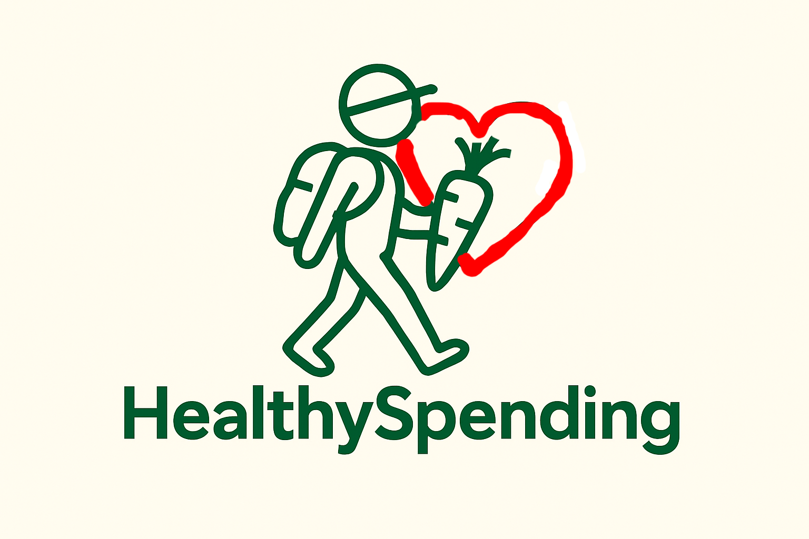

<p align="center">
  
</p>
🥗 HealthySpending

**Track healthiness. Find deals. Eat better.**

HealthySpending is an open-source platform designed to help people track the nutritional value of their food and locate high-quality, healthy options at affordable prices (or even free!). We believe healthy eating should be accessible to everyone, regardless of budget.

## 🚀 Project Goal
To democratize access to healthy food data by crowdsourcing prices, locations, and nutritional quality ratings. We use a **Meritocracy Model** to reward active contributors.

## 🌟 Features
* **Food Tracking:** Monitor the healthiness of your daily intake.
* **Budget Map:** Find shops and cafes with the best price-to-health ratio.
* **Community Forum:** Share advice and ask questions about nutrition.
* **User Rating System:** A gamified leaderboard where contributions earn you status.

## 🤝 How to Contribute
We welcome contributions from everyone! Find your role below:

### 🏪 Shop Owners
* **Action:** Add your business to our database.
* **Benefit:** Get verified status and promote special offers to our health-conscious user base.
* **How:** Submit a request via the "For Business" tab in the app.

### 🏙️ City Explorers
* **Action:** Visit local shops, verify prices, and mark locations on the map.
* **Benefit:** Earn points for the "Explorer Leaderboard" and unlock special app features.
* **How:** Use the "Add Location" button in the app.

### 🍎 Nutritionists
* **Action:** Verify the health claims of products and businesses. Write articles for our wiki.
* **Benefit:** Gain the "Verified Expert" badge and increase professional visibility.
* **How:** Apply for the Analytics Team in your user profile settings.

### 💻 Developers & Designers
* **Action:** Help us modernize the website, fix bugs, or design new features.
* **How:** See `CONTRIBUTING.md` for technical instructions.

## 🛠️ Installation (For Developers)

1.  **Clone the repository**
    ```bash
    git clone [https://github.com/YourUsername/HealthySpending.git](https://github.com/YourUsername/HealthySpending.git)
    cd HealthySpending
    ```

2.  **Install dependencies**
    ```bash
    npm install
    ```

3.  **Run the local server**
    ```bash
    npm start
    ```

## 📜 License
This project is licensed under the Apache2.0 - see the [LICENSE file](LICENSE) for details.ng.
